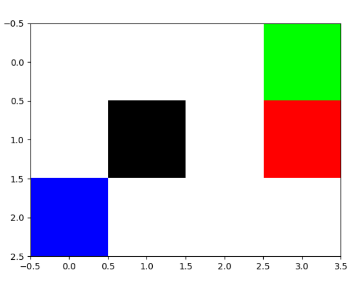

# Monte Carlo Gridworld

A simple example of Monte Carlo Reinforcement Learning in a Gridworld.

### Environment Description

The environment is a 3x4 grid world with two terminal states (green: +1, red: -1).
There is a black square at the center which cannot be entered.

The agent can move in every direction (up, down, left, right). However, the environment is stochastic: The environment forces agent to move along the direction it chose with probability 0.8 or move along the two perpendicular directions with probability 0.1 each.

### Agent Description

The agent uses Monte Carlo (with ε-greedy) to reach the optimal policy.

It generates 5 episodes with the current policy, 
then evaluates the policy using the mean sum of expected discounted rewards for each state.
Then the agent optimizes the policy by choosing the action that maximizes the expected utility for each state.

The agent knows the dynamics of the environment, 
therefore it only needs to calculate the expected reward of each state rather that state-action pair.
This requires far less episodes to reach the optimal policy.

### How to run

Execute the file run_simulation.py. 

This will start the experiment and visualize the training process.
At the end a plot is generated, which shows the RMSE (root mean square error)
of two consecutive policy evaluations, for each iteration.

